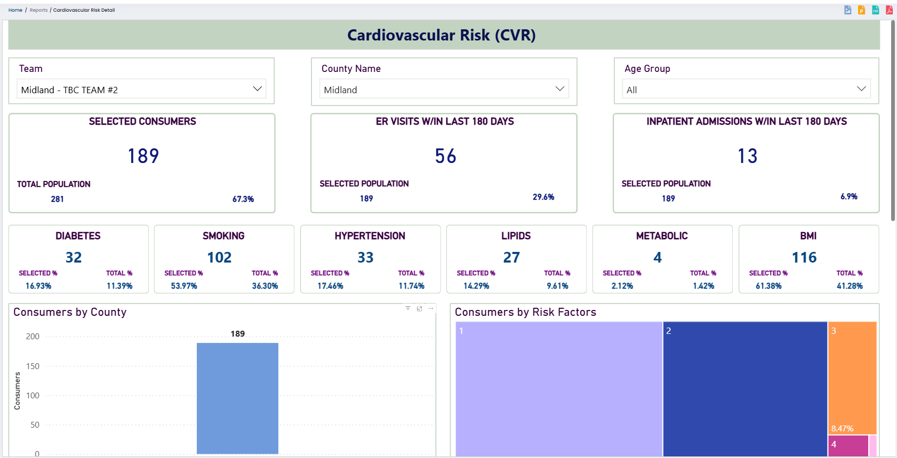

## 📊 Other Activities

### 🗄️ Database Administration
- Automated backups and retention
- Migrated Access databases to SQL Server
- Hardened security and managed permissions
- Monitored SQL Agent jobs via Power Automate

### ⚙️ Performance Tuning
- Indexing strategies
- Query optimization and execution plans
- Partitioning and archiving

### 🔄 Data Integration & Reporting
- Migrated Access queries to SQL views
- Integrated Power BI and Excel with stored procedures
- Built ETL pipelines using SSIS, PowerShell, and custom scripts

### 🔐 High Availability & Disaster Recovery
- Designed backup and job scripting strategies

### 🤖 Automation
- Created Power Automate alerts for ETL errors, replica issues, and data mismatches

### 📈 Departmental Reporting
- **QI**: Compliance, Teams phone logs  
- **HR**: Directory, safety, audits  
- **IT**: Upgrade tracking, phone usage  
- **Finance**: Services, payroll, benefits  
- **Health Services**: Grant-funded project dashboards

---
