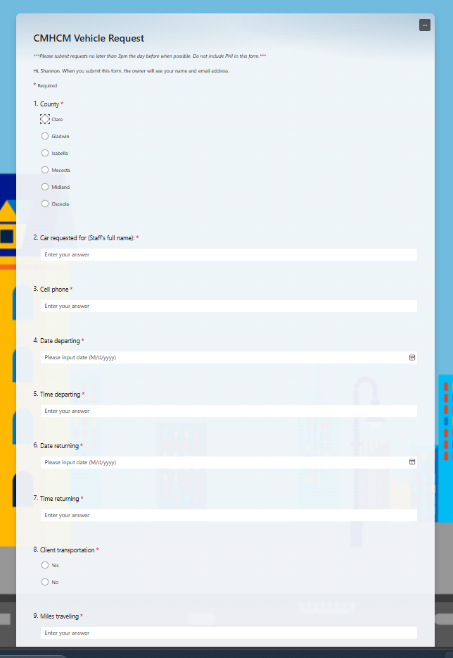

# Database Administrator | Automation Architect | Bridging Clinical Insight with Technical Precision

## 🧠 About Me

My professional journey began in clinical health psychology, where I earned BA, MS, and PhD degrees and worked in medical and healthcare settings. In the 2010s, I transitioned into the IT field, earning a BS in Cybersecurity and Network Administration. I began in helpdesk support at a mental health agency, then served as an Application Analyst for a major hospital system’s electronic health record (EHR). I returned to the mental health agency and advanced to my current role as Database Administrator, which I’ve held since January 2022.

### 💡 DBA Philosophy
I prioritize security, reliability, availability, and data integrity. My approach centers on automating routine tasks to free up time for optimization, business continuity, and strategic improvements.

### 🛠️ Core Skills
- **Early Career**: Professional practice, research, teaching  
- **Mid Career**: Network and security, hardware/software configuration, EHR implementation and training  
- **Current**: Database management, performance tuning, automation, security, ETL, business analysis, dashboard development, application development, staff training

### 🧰 Tools & Technologies
SQL Server, SSMS, SSIS, Azure, Power Automate, Power BI, Visio, VBS, Excel

---

## 🚀 Highlighted Projects

### 🔹 Finance Automation
**Payroll & Benefit Allocation**  
Automated a complex Excel-based payroll allocation process using SQL Server and Power Automate. Replaced manual steps with scalable SQL logic to reduce finance staff workload from days to minutes.

**EHR Payroll Data Upload**  
Built a Power App-triggered SQL process that generates XML files for vendor upload via SFTP. Reduced manual Excel work and streamlined compliance reporting.

### 🔹 HR & Staff Systems
**HR Profile Change Alerts**  
Created a SQL + Power Automate system that tracks daily HR profile changes and sends alerts to IT ticketing. Eliminated manual reporting and improved data accuracy.

**HR Software Migration**  
Rebuilt ETL pipelines and downstream reports following a major HR system change. Successfully transitioned to new data structures under tight deadlines.

**Organizational Charts Automation**  
Used Visio and SQL to semi-automate org chart creation for 500+ staff. Saved HR hours of manual updates.

### 🔹 Operational Applications
**Vehicle Reservation System**  
Replaced paper-based vehicle booking with a Microsoft Forms + Power Automate solution. Unified six counties under one digital process.

**Mileage Tracking App**  
Digitized mileage reporting for staff travel. Improved data security and reduced clerical workload.

**Safety Incident Reporting**  
Built a modern incident reporting app using Forms, SQL, and Power Automate. Automated alerts and centralized data storage.

**Medicaid Redetermination App**  
Developed an ASP.NET app to track patient Medicaid eligibility. Incorporated complex logic and exceptions for COVID-era policies.

**Operational Productivity Dashboard**  
Rebuilt a legacy VBS-powered report into a SQL + Power BI dashboard. Improved usability and backend efficiency.

### 🔹 Infrastructure Projects
**SQL Server 2022 Migration**  
Led migration from SQL Server 2019 to Azure-hosted SQL Server 2022. Coordinated vendor ETL processes and improved performance and security.

**EHR Replica Security Upgrade**  
Implemented SSH key authentication and SQL encryption for EHR data replication. Ensured secure and compliant data transfer.

---

## 📊 Other Activities

### 🗄️ Database Administration
- Automated backups and retention
- Migrated Access databases to SQL Server
- Hardened security and managed permissions
- Monitored SQL Agent jobs via Power Automate

### ⚙️ Performance Tuning
- Indexing strategies
- Query optimization and execution plans
- Partitioning and archiving

### 🔄 Data Integration & Reporting
- Migrated Access queries to SQL views
- Integrated Power BI and Excel with stored procedures
- Built ETL pipelines using SSIS, PowerShell, and custom scripts

### 🔐 High Availability & Disaster Recovery
- Designed backup and job scripting strategies

### 🤖 Automation
- Created Power Automate alerts for ETL errors, replica issues, and data mismatches

### 📈 Departmental Reporting
- **QI**: Compliance, Teams phone logs  
- **HR**: Directory, safety, audits  
- **IT**: Upgrade tracking, phone usage  
- **Finance**: Services, payroll, benefits  
- **Health Services**: Grant-funded project dashboards

---

## 🌟 Testimonials & Recognition
*Employee recognition board (to be added)*

---

## 📬 Contact
*Details to be added*
