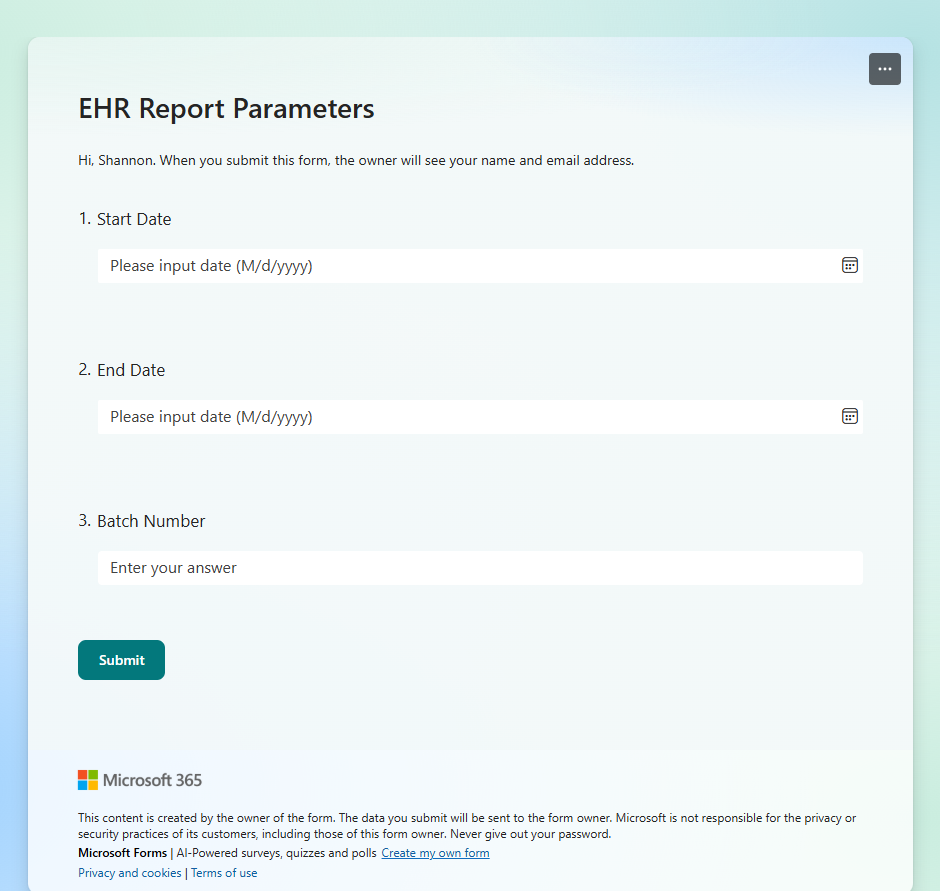
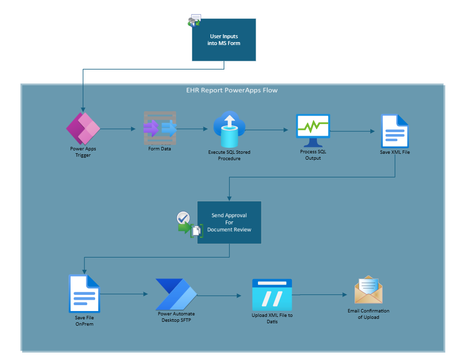
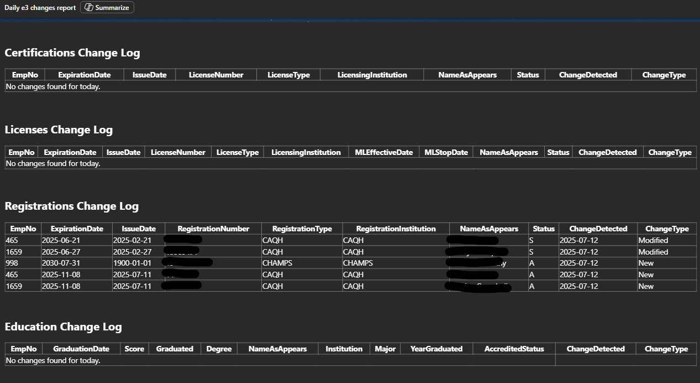
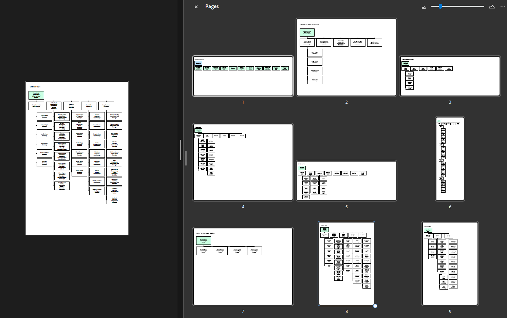
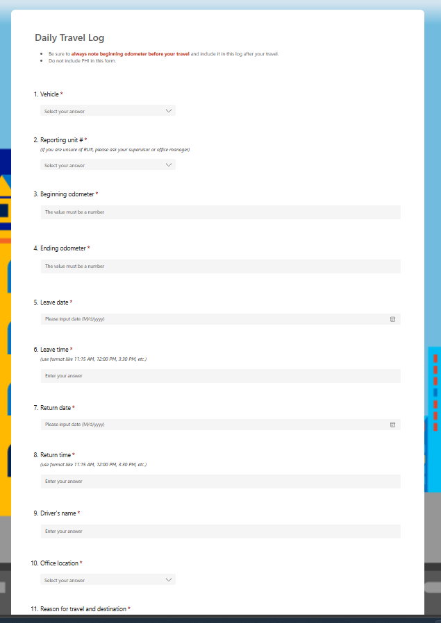

## 🚀 Highlighted Projects

### 🔹 Finance Automation
**Payroll & Benefit Allocation**  
Automated a complex Excel-based payroll allocation process using SQL Server and Power Automate. Replaced manual steps with scalable SQL logic to reduce finance staff workload from days to minutes.

**EHR Payroll Data Upload**  
Built a Power App-triggered SQL process that generates XML files for vendor upload via SFTP. Reduced manual Excel work and streamlined compliance reporting.

### 🔹 HR & Staff Systems
**HR Profile Change Alerts**  
Created a SQL + Power Automate system that tracks daily HR profile changes and sends alerts to IT ticketing. Eliminated manual reporting and improved data accuracy.

**HR Software Migration**  
Rebuilt ETL pipelines and downstream reports following a major HR system change. Successfully transitioned to new data structures under tight deadlines.

**Organizational Charts Automation**  
Used Visio and SQL to semi-automate org chart creation for 500+ staff. Saved HR hours of manual updates.

### 🔹 Operational Applications
**Vehicle Reservation System**  
Replaced paper-based vehicle booking with a Microsoft Forms + Power Automate solution. Unified six counties under one digital process.

**Mileage Tracking App**  
Digitized mileage reporting for staff travel. Improved data security and reduced clerical workload.

**Safety Incident Reporting**  
Built a modern incident reporting app using Forms, SQL, and Power Automate. Automated alerts and centralized data storage.

**Medicaid Redetermination App**  
Developed an ASP.NET app to track patient Medicaid eligibility. Incorporated complex logic and exceptions for COVID-era policies.

**Operational Productivity Dashboard**  
Rebuilt a legacy VBS-powered report into a SQL + Power BI dashboard. Improved usability and backend efficiency.

### 🔹 Infrastructure Projects
**SQL Server 2022 Migration**  
Led migration from SQL Server 2019 to Azure-hosted SQL Server 2022. Coordinated vendor ETL processes and improved performance and security.

**EHR Replica Security Upgrade**  
Implemented SSH key authentication and SQL encryption for EHR data replication. Ensured secure and compliant data transfer.

---
